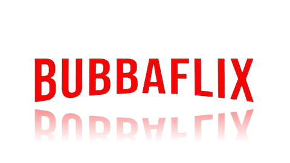

<p align="center">
  
</p>

# BubbaFlix 🎬 - Movie & TV Show Streaming, Live TV & Discovery App (v1.0.4)

BubbaFlix is a modern, high-performance movie and TV show streaming discovery platform built with **React 18**, **Redux Toolkit**, **React Router v6**, **Vite**, **Pure Node.js**, **Native Android TV (Kotlin / ExoPlayer)**, and integrated with **Dispatcharr Live TV & EPG**, **AIOStreams (ElfHosted + Premiumize)**, **TMDB**, **Groq AI**, and **SIMKL**.

BubbaFlix features **📡 Dispatcharr Live TV & EPG Integration**, **🔍 Dedicated Interactive Search Page (`/search`)**, **⭐ Favorites Section & Star Toggle Persistence**, **Native Android TV App (`android-tv/`) with ExoPlayer 5-Minute Ahead-Buffering & Automatic Dispatcharr Settings Inheritance**, **Automatic Web Audio Transcoder (AC3/EAC3/DTS → AAC)**, **Unlocked Smart TV D-Pad Spatial Navigation with Focus Retention**, **Canonical OTA Version Updates (`version.json`)**, **Groq AI Llama 3 Stream Title Filtering**, **Official SIMKL Watch History Sync**, and **Centralized Backend Transcoder Proxy**.

---

## 📲 Downloader App Quick Install

Install **BubbaFlix TV** directly on any Firestick, Fire TV, or Android TV device using the **Downloader** app:

> 🔥 **Downloader Code**: **`7862216`**
> 
> 🔗 **Direct APK URL**: `https://raw.githubusercontent.com/jsanderstechnologies/BubbaFlix/master/BubbaFlixTV.apk`

---

## 🌟 Key Features

### 📡 Dispatcharr Live TV & EPG Integration (`/livetv`)
- **Live Guide & EPG**: Browse Live TV channels, current show programming, and electronic program guides directly from your local Dispatcharr instance.
- **1-Click Live Streaming**: Instant high-speed HLS playback of Live TV streams in `VideoPlayerModal` or ExoPlayer.
- **DVR Scheduling & Recordings**: Schedule upcoming show recordings and play back recorded DVR video files directly inside the app.
- **Single Centralized Configuration**: Dispatcharr Server URL and API Key are configured cleanly in the **Settings** page (`/settings`).
- **Automatic TV App Inheritance**: Android TV devices automatically pull and sync Dispatcharr settings from your backend server on startup without entering IP/keys on TV remotes!

### 🔍 Dedicated Interactive Search Page (`/search`)
- **Interactive Search Page**: Standalone menu item and dedicated route (`/search`) with a large, auto-focused D-Pad input bar.
- **Category Filter Chips**: 1-click filter between **All Results**, **Movies Only**, and **TV Series Only**.
- **Popular Search Suggestions**: 1-click search tags (*Action*, *Comedy*, *Marvel*, *Sci-Fi*, *Horror*, *Drama*, *Animation*, *Thriller*).
- **Focus Retention**: Spatial D-Pad navigation retains input focus while typing until you explicitly press Down to browse the results grid.

### 📺 Native Android TV, Google TV & Fire TV App (`android-tv/`)
- **Downloader Quick Install**: Enter code **`7862216`** in the Downloader app to install `BubbaFlixTV.apk` directly on your TV.
- **Single Clean Build Name**: Builds directly to `BubbaFlixTV.apk` without cumbersome version suffixes.
- **5-Minute Ahead-Buffering Engine**: ExoPlayer (`PlayerActivity.kt`) buffers up to 300 seconds (5 minutes) ahead with `DefaultLoadControl` to eliminate micro-stutters and video freezing on high-bitrate 4K / 1080p streams.
- **Canonical OTA Update Checker**: Automatically checks `version.json` on app launch and prompts the user with an interactive update notification.
- **Native Android TV Launcher Banner**: Includes full Leanback launcher integration (`LEANBACK_LAUNCHER`) for Android TV, Google TV, Chromecast, Nvidia Shield, and Amazon Fire TV devices.

### ⭐ Favorites Section & Persistence
- **Dedicated Favorites Page (`/favorites`)**: View all saved favorite movies and TV series in one centralized location with filter tabs (**All**, **Movies**, **TV Series**).
- **Details Screen Star Toggle (`FavoriteStar`)**: Toggle items in and out of Favorites directly from their details screen with instant visual feedback.

### 🔊 Automatic Web Audio Transcoder & Nginx Engine
- **Universal Audio Codec Transcoding**: Web browsers lack native decoders for AC3 (Dolby Digital), EAC3 (Dolby Digital Plus), TrueHD, and DTS audio tracks. The backend FFmpeg engine (`/api/transcode`) automatically converts unsupported audio into standard stereo AAC (`-c:a aac -b:a 192k -ac 2`), guaranteeing clear, loud audio across all web browsers.
- **Nginx Transcoder Proxy**: Pre-configured in `nginx.conf` (`proxy_pass http://127.0.0.1:5000;`) for unbuffered real-time video/audio streaming.

---

## ⚙️ Docker / Portainer / CasaOS Environment Variables

Pre-configure your API credentials and Dispatcharr settings directly in `docker-compose.yml`, Portainer Stacks, or CasaOS container settings:

| Environment Variable | Description | Default Value |
| :--- | :--- | :--- |
| `DISPATCHARR_URL` | Dispatcharr Server URL | `http://192.168.1.100:9191` |
| `DISPATCHARR_API_KEY` | Dispatcharr API Key (Optional) | `""` |
| `AIOSTREAMS_URL` | AIOStreams Addon Manifest URL | `https://aiostreams.elfhosted.com/` |
| `SIMKL_CLIENT_ID` | SIMKL API Client ID | `""` |
| `GROQ_API_KEY` | Groq AI Stream Filter API Key | `""` |
| `TMDB_READ_ACCESS_TOKEN` | TMDB v4 Read Access Token | Built-in fallback |

Settings persist across container restarts using the Docker volume mapping: `bubbaflix-data:/app/server`.

---

## 📱 Android TV APK Build & Deployment

- **Downloader App Code**: **`7862216`**
- **Canonical APK Download**: [`BubbaFlixTV.apk`](https://raw.githubusercontent.com/jsanderstechnologies/BubbaFlix/master/BubbaFlixTV.apk)
- **Version Check JSON**: [`version.json`](https://raw.githubusercontent.com/jsanderstechnologies/BubbaFlix/master/version.json)

To build the native Android TV APK manually:
```bash
cd android-tv
$env:JAVA_HOME = "C:\Program Files\Android\Android Studio\jbr"
.\gradlew.bat assembleRelease
```
See [`android-tv/README.md`](file:///f:/Cyberflix/android-tv/README.md) for step-by-step sideloading & installation guides.

---

Made with ❤️ by [jsanderstechnologies](https://github.com/jsanderstechnologies).
